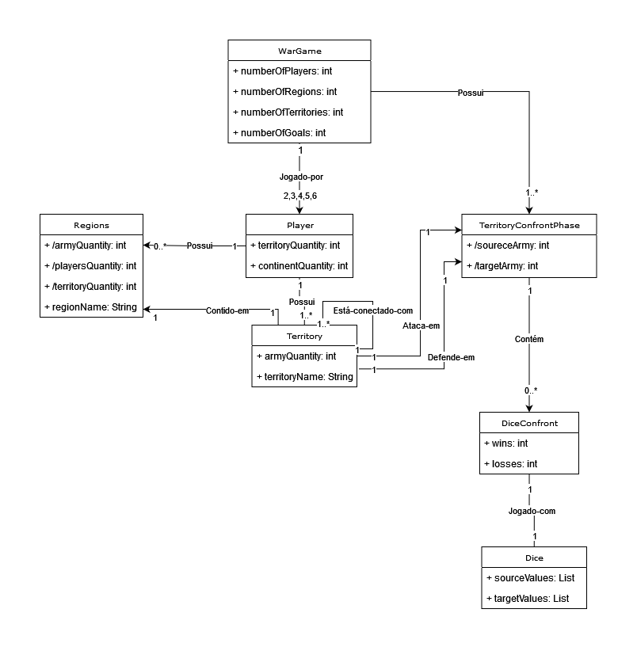

# Modelo de Domínio do escopo Fase de Ataque entre Territórios:
O seguinte modelo de domínio inclui as classes conceituais:
- `Regions`: Se refere às 6 regiões do jogo de tabuleiro War.
- `Player`: Ator principal durante o ataque entre territórios
- `Combat`: Confronto entre territórios adjacentes por meio do jogo de dados 
- `Border`: Delimita as adjacencias entre os territórios e regiões
- `Territory`: Elemento do jogo ocupado pelos exércitos de um jogador
- `Army`: Elemento do jogo utilizado pelos jogadores para atacar outros territórios 
- `Dice Confront`: Ação realizada pelos jogadores durante a fase de ataque de uma jogada
- `Attack Dice`: Dados utilizados pelo território atacante durante um confronto de dados
- `Defense Dice`: Dados utilizados pelo território defensor durante um confronto de dados

|  | 
|:--:| 
| *Domain Model Territory Confront War Game* |